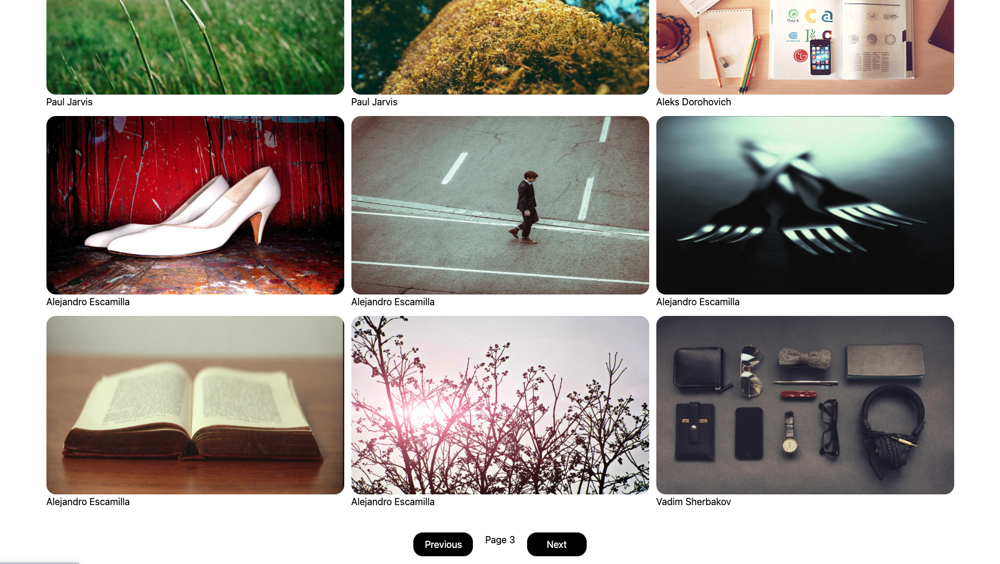

# 🖼️ Gallery Project (React)

A clean and responsive **Image Gallery App** built using React. This project fetches images from a public API and displays them in a paginated grid layout with smooth user interaction.

---

## ✨ Features

* Fetch images dynamically using **API (Axios)**
* Pagination support (Next / Previous)
* Responsive image grid layout
* Loading state handling
* External image links (open in new tab)
* Clean UI using **Tailwind CSS**

---

## 🧠 Concepts Used

* React Components
* useState & useEffect Hooks
* API Handling with Axios
* Conditional Rendering
* Array Mapping (`map`)
* Event Handling
* Tailwind CSS (utility-first styling)

---

## 📁 Project Structure

```bash
src/
 ├── App.jsx              # Main application logic
 ├── App.css              # (Optional / can be removed if unused)
 ├── index.css            # Tailwind CSS import
 ├── main.jsx             # Entry point
```

---

## 📸 Preview



---

## 🛠️ Tech Stack

* React (Vite)
* JavaScript (ES6)
* Tailwind CSS
* Axios
* HTML (JSX)

---

## ⚙️ How It Works

* Images are fetched from the **Picsum API**
* Each page loads 9 images using pagination
* Clicking **Next / Previous** updates the page
* Images are rendered dynamically using `map()`
* Loading state improves user experience

---

## 🚀 Installation & Setup

```bash
git clone https://github.com/hrjoshi1302/gallery-project.git
cd gallery-project
npm install
npm run dev
```

---

## 👨‍💻 Author

**Himal Joshi**
